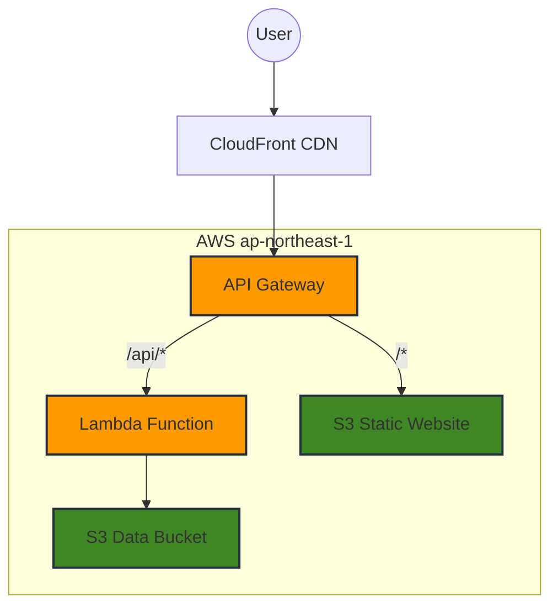

# Serverless Vue.js TODO App

這是一個完全無伺服器 (Serverless) 架構的 TODO List 應用程式。前端使用 Vue.js，後端採用 AWS Lambda，並透過 API Gateway 實現智慧流量分流。

## 🏗️ 系統架構

本專案使用 **AWS API Gateway** 作為核心負載平衡器，根據請求路徑將流量分流至不同後端：

- **API 流量 (`/api/*`)**: 路由至 **AWS Lambda** 處理業務邏輯 (CRUD)，資料儲存於 **S3**。
- **靜態資源 (`/*`)**: 路由至 **S3** 靜態網站託管，提供 Vue.js 前端檔案。
- **全球加速**: 最前端使用 **CloudFront** CDN 進行快取與傳輸加速，並實施地區限制 (Geo Restriction)。



## 🚀 快速部署

### 前置要求
- AWS CLI 已設定完成
- Terraform >= 1.0
- Node.js >= 16

### 1. 部署基礎設施
使用 Terraform 部署所有 AWS 資源：

```bash
cd terraform
terraform init
terraform apply
```
*確認輸入 `yes` 執行部署。部署完成後將顯示 CloudFront Domain 等資訊。*

### 2. 編譯與上傳前端
系統會自動生成 `.env.production`，只需編譯並上傳：

```bash
# 回到專案根目錄
cd ..
npm install
npm run build

# 上傳到 S3 (將 <bucket-name> 替換為 terraform output 的 website_bucket_name)
aws s3 sync dist/ s3://<bucket-name> --delete --region ap-northeast-1

# 刷新 CloudFront 快取 (將 <dist-id> 替換為 cloudfront_distribution_id)
aws cloudfront create-invalidation --distribution-id <dist-id> --paths "/*"
```

## ✅ 驗證測試

### 驗證 API Gateway 分流規則
我們可以透過檢查回傳的 **Content-Type** 來驗證流量是否正確分流。

#### 1. 驗證靜態網頁 (預期流向 S3)
請求根目錄 `/`，應回傳 HTML 檔案。
```bash
curl -s -D - -o /dev/null https://<your-cloudfront-domain>/
```
> **預期結果**: `HTTP/2 200`，`content-type: text/html` (證明來自 S3)

#### 2. 驗證 API (預期流向 Lambda)
請求 API 路徑，應回傳 JSON 資料。
```bash
curl -s -D - https://<your-cloudfront-domain>/api/todos
```
> **預期結果**: `HTTP/2 200`，`content-type: application/json` (證明來自 Lambda)

## 🗑️ 資源銷毀

若需移除所有部署的資源以避免產生費用，請執行：

**注意**: 執行前請確保 S3 bucket 已清空 (Terraform 可能無法刪除含有物件的 bucket)。

```bash
# 1. 清空 S3 Buckets (請手動替換 bucket 名稱)
aws s3 rm s3://<website-bucket-name> --recursive
aws s3 rm s3://<data-bucket-name> --recursive

# 2. 銷毀基礎設施
cd terraform
terraform destroy
```
*輸入 `yes` 確認銷毀。*
