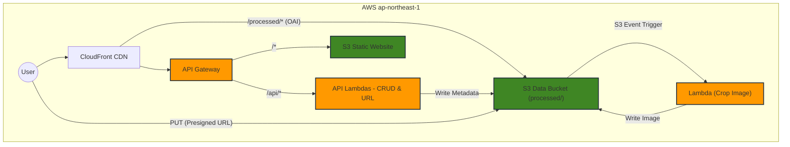

# Serverless Vue.js TODO App

這是一個完全無伺服器 (Serverless) 架構的 TODO List 應用程式。前端使用 Vue.js，後端採用 AWS Lambda，並透過 API Gateway 實現智慧流量分流。

## 🏗️ 系統架構

本專案使用 **AWS API Gateway** 作為核心負載平衡器，根據請求路徑將流量分流至不同後端：

- **API 流量 (`/api/*`)**: 路由至 **AWS Lambda** 處理業務邏輯 (CRUD) 與核發 S3 首傳授權 (Presigned URL)。
- **靜態資源 (`/*`)**: 路由至 **S3 Website Bucket** 提供 Vue.js 前端檔案。
- **圖片資源 (`/processed/*`)**: 路由至 **S3 Data Bucket** (透過 OAI 安全讀取) 提供裁切後的圖片。
- **背景處理**: S3 `raw/` 區收到圖片時，自動觸發 Lambda (`sharp` 套件) 進行正方形裁切並存入 `processed/` 區。
- **全球加速**: 最前端使用 **CloudFront** CDN 進行快取與傳輸加速，並實施地區限制。


```

## 🚀 快速部署

### 前置要求
- AWS CLI 已設定完成
- Terraform >= 1.0
- Node.js >= 16

### 1. 部署基礎設施
使用 Terraform 部署所有 AWS 資源：

```bash
cd terraform
terraform init
terraform apply
```
*確認輸入 `yes` 執行部署。部署完成後將顯示 CloudFront Domain 等資訊。*

### 透過 GitHub Actions 自動部署
本專案已包含完整的 CI/CD 流程 (`.github/workflows/deploy.yml`)，只要推送到 `main` 分支即可自動打包並上傳 S3。

**必須至專案設定的 `Settings > Secrets and variables > Actions` 新增以下機密資訊 (Secrets)：**
1. `VUE_APP_API_BASE_URL`: API Gateway 或 CloudFront 的網址 (例如：`https://d3ir7v35iscc10.cloudfront.net`)
2. `AWS_ACCESS_KEY_ID`: Terraform 輸出的 `github_actions_access_key_id`
3. `AWS_SECRET_ACCESS_KEY`: IAM User 的 Secret Access Key (需手動使用 `terraform output -raw` 解鎖查看)
4. `AWS_S3_BUCKET`: Terraform 輸出的 `website_bucket_name`
5. `AWS_CLOUDFRONT_DISTRIBUTION_ID`: Terraform 輸出的 `cloudfront_distribution_id`

## 📸 圖片處理核心流程
此專案實現了無伺服器的圖片非同步裁切，避免大型圖檔上傳佔用後端資源與時間：
1. 前端向 `/api/upload-url` 申請具時效性的 **S3 Presigned URL**。
2. 前端透過該 URL 將圖片以 PUT 方法**直傳**進 S3 `raw/` 目錄。
3. `raw/` 區接收圖片後，觸發 S3 Event Notification 呼叫 `crop_image` Lambda。
4. Lambda 使用 `sharp` 將短邊作為基準對齊中心進行正方形裁切。
5. 完成品寫入 `processed/` 目錄。
6. 前端利用自動重試載入機制 (`@error` listener)，平滑等待並顯示 CloudFront 上的最終裁切成品。

> **⚠️ Lambda 與 `sharp` 的相容性警告**：
> 由於支援跨平台的影像處理引擎 `sharp` 依賴原生 C++ 函式庫，我們已在 `terraform/lambda.tf` 中加入了 `null_resource`，在打包壓縮前會透過 `npm install --os=linux --cpu=x64 sharp` 確保打包到雲端的環境與 AWS Lambda (Linux) 相容。不可在 Windows/Mac 上打包 `node_modules` 後直接上傳，否則會在執行時發生模組無法加載的致命錯誤。

## ✅ 驗證測試

### 驗證 API Gateway 分流規則
我們可以透過檢查回傳的 **Content-Type** 來驗證流量是否正確分流。

#### 1. 驗證靜態網頁 (預期流向 S3)
請求根目錄 `/`，應回傳 HTML 檔案。
```bash
curl -s -D - -o /dev/null https://<your-cloudfront-domain>/
```
> **預期結果**: `HTTP/2 200`，`content-type: text/html` (證明來自 S3)

#### 2. 驗證 API (預期流向 Lambda)
請求 API 路徑，應回傳 JSON 資料。
```bash
curl -s -D - https://<your-cloudfront-domain>/api/todos
```
> **預期結果**: `HTTP/2 200`，`content-type: application/json` (證明來自 Lambda)

## 🗑️ 資源銷毀

若需移除所有部署的資源以避免產生費用，請執行：

**注意**: 執行前請確保 S3 bucket 已清空 (Terraform 可能無法刪除含有物件的 bucket)。

```bash
# 1. 清空 S3 Buckets (請手動替換 bucket 名稱)
aws s3 rm s3://<website-bucket-name> --recursive
aws s3 rm s3://<data-bucket-name> --recursive

# 2. 銷毀基礎設施
cd terraform
terraform destroy
```
*輸入 `yes` 確認銷毀。*
