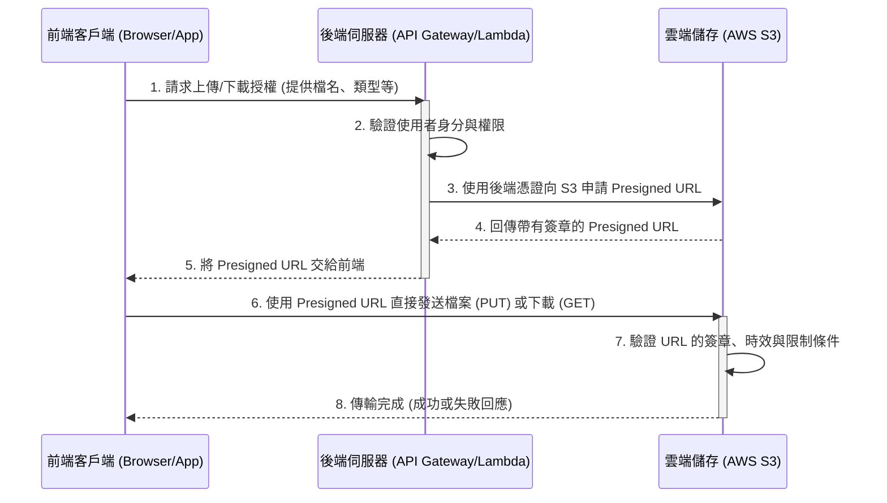

# Presigned URL (預先簽名 URL)

## 核心概念
Presigned URL 是一種由雲端儲存服務（如 AWS S3）提供的安全授權機制。它允許你在**不公開整個儲存體（Bucket）**且**不洩漏系統存取憑證**的情況下，授予使用者對雲端特定檔案的「臨時存取權」（上傳或下載）。本質上是一張由後端核發的**有時效性且用途受限的限時通行證**。

## 解決的問題與優勢
1. **減輕後端負擔**：實現「客戶端直連雲端」，檔案不再需要經過後端伺服器中轉，大幅節省頻寬與伺服器效能。
2. **強大的安全性**：雲端儲存空間可保持 100% Private (私有)，僅透過帶有加密簽章的 URL 授權放行。
3. **細粒度控制**：可嚴格限制 URL 的時效性、操作類型（GET/PUT）、特定檔案路徑與檔案大小等。
4. **避免憑證外洩**：雲端存取金鑰安全地保留在後端，前端只會拿到臨時且受限的 URL。

## 架構與流程圖

## 潛在危險與安全風險
* **網址外洩等同權限外洩 (URL Leakage)**：網址不認身分，拿到網址即可操作。**對策**：使用 HTTPS 傳輸並縮短有效期限。
* **資源耗竭 (Resource Exhaustion)**：惡意上傳超大檔案。**對策**：使用 `Presigned POST` 加上 `content-length-range` 限制檔案大小。
* **檔案覆蓋或惡意植入**：由前端決定路徑導致安全漏洞。**對策**：上傳的 `Object Key` 路徑與檔名必須由後端隨機生成（如 UUID）。

## 核心限制條件
* **嚴格的一對一關聯**：一個 URL 只能用於上傳/下載**一個特定路徑**的檔案。
* **HTTP Method 綁定**：生成時設定的行為（如 PUT）不可變更，使用錯誤的 Method 會被拒絕 (403 Forbidden)。
* **憑證相依性**：若生成 URL 的後端角色暫時憑證過期，即使 URL 尚未到達失效時間，也會強制失效。

## 實戰開發注意事項 (踩坑指南)
1. **CORS 跨來源資源共用**：必須在 S3 Bucket 設定 CORS 規則，允許前端網域的跨網域請求 (PUT/GET)。
2. **時效性平衡**：太短（例如 1 分鐘）可能導致大檔案傳輸中途中斷，太長則增加安全風險。一般建議 5~15 分鐘。
3. **超大檔案處理**：針對極大檔案不建議使用單一 Presigned URL，應改用 **Multipart Upload (分段上傳)** 機制。
4. **Headers 完全一致**：前端發送請求時附帶的 HTTP Headers（如 `Content-Type`）必須與後端生成簽章時完全一致，否則簽章將驗證失敗。

## API Gateway 的分流設計 (Load Balancer / Reverse Proxy)
在這套架構中，API Gateway 被用作處理流量入口與分流的最佳實踐：

* **`/api` 導向 (Lambda)**：任何位於 `/api` 前綴的請求（例如 `/api/todos` 或 `/api/upload-url`），會被 AWS_PROXY Integration 攔截並轉送給指定的 Lambda 函數處理後端邏輯。
* **其他路徑 (S3 靜態網頁)**：除了明確定義的 `/api` 後端介面外，利用 `/{proxy+}` 與 `/` 將所有剩餘流量，透過 HTTP_PROXY 轉發到 S3 靜態網站終端點。

**如此設計的兩大好處：**
1. **解決 CORS 問題**：首頁與 API 皆在同一個 Domain（API Gateway 的 URL）底下提供服務，前端在發送 API 請求時不受瀏覽器跨網域限制。
2. **單一入口點 (Single Entry Point)**：前後端基礎設施的複雜性對外完全隱藏，為使用者與開發者提供整潔一致的存取網址。
